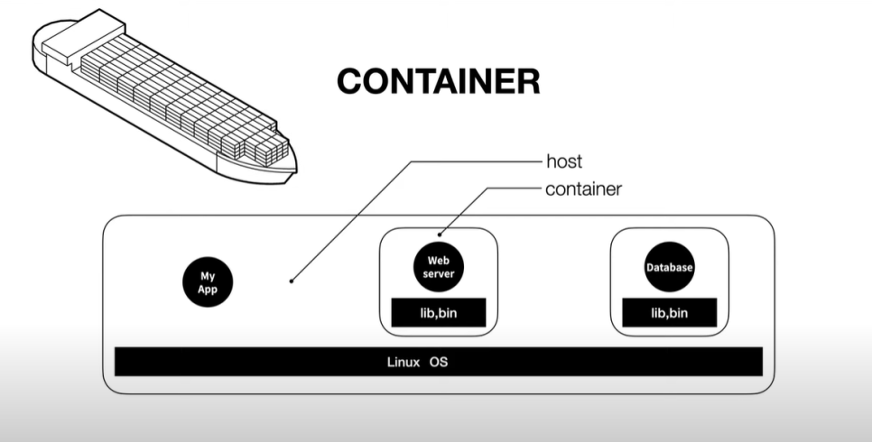

# Introduction

## Docker 

- 어떤 OS에서도 같은 환경을 만들어주는 것
- 서버에 Docker만 설치 후 배포

## Container

기본적으로 호스트(HOST) 컴퓨터에서 돌아가고 있는 하나의 프로세스

## Virtual environment vs container

| VM                                            | Container                                |
|-----------------------------------------------|------------------------------------------|
| - 자체적인 운영체제를 포함하고 있어서 하드웨어 리소드를 많이 잡아 느리고 무거움 | - VM처럼 격리된 환경에서도 일반 프로세스처럼 빠르고 가볍게 돌아간다. |

## Image(Container image)
애플리케이션 코드 뿐만 아니라 애플리케이션 실행에 필요한 최소한의 환경(언어 런타임, 라이브러리 패키지)을 포함하고 있는 바이너리(binary) 파일

- 하나의 image로 부터 동일한 container를 계속해서 만들어 낼 수 있으며, 동시에 여러 개의 container를 띄울 수도 있어서 확장성(scalability)이 좋다.
- 어떤 컴퓨터에서든지 Docker만 설치 되어있다면 image를 내려받아 container로 구동하면 동일하게 작동하는 애플리케이션을 얻을 수 있다.

## Container vs Image

- Image는 container의 스냅샷을 떠놓은 것
- Container는 컴퓨터에서 살아서 돌아가고 있는 image의 한 인스턴스(instance)라고 생각

image를 실행시키면(run) 이미지가 container가 되고, 컨테이너가 실행되면서 컨테이너 안에 포함되어 있는 image가 실행되도록 조치되어있는 프로그램이 실행

| program | image |
|---------|---|
| process | container |

## 컨테이너 기술

- HOST(호스트): 운영체제가 설치된 컴퓨터
- Container(컨테이너): 호스트에서 실행되는 격리된 각각의 실행 환경
  - 각각의 컨테이너에는 운영체제 전체가 설치되어 있는 것이 아니라 앱을 실행하는 데 필요한 라이브러리와 실행 파일들만 포함되어 있다. 각각의 앱은 이렇게 컨테이너라는 격리된 공간에서 실행
  - 이미 존재하는 운영체제를 공유하니 무엇인가를 설치할 필요가 없고, 운영체제가 하나이기 때문에 속도가 느려지지 않고, 저장장치의 용량을 줄일 수 있다. 컨테이너 기술을 이용해서 이런 일을 쉽게 해주는 소프트웨어들 중 가장 많이 이용하는 제품이 "도커"

## 도커 네트워크: 포트 포워딩(Port forwarding)
