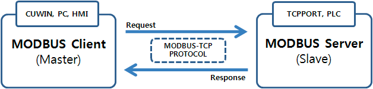
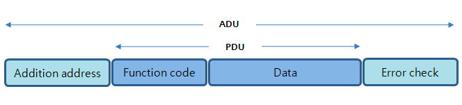
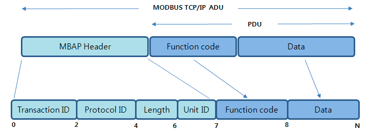

# Modbus TCP

산업용 필드버스 분야에서 자주 사용되는 통신 프로토콜 이다.

TCP/IP 네트워크 상에서 상위장치와 하위 장치간의 인터페이스를 위하여 고안된 통신 방법이다.

MODBUS-TCP 통신 규격에는 마스터(Client)와 슬레이브(Server)의 역할이 나뉘어져 있다.

슬레이브(Server)는 마스터(Client)가 요청하는 데이터에 대해 응답을 해준다.

주로 마스터(Client)에는 산업용터치 HMI 기기, 또는 PC와 같은 상위 기기가 위치한다.

그리고 슬레이브(Server)에는 TCPPORT 나 PLC 등이 위치한다.

슬레이브(Server)는 상위기기에서 요청하는 동작만을 하는 수동적인 위치에 존재해 있다.

마스터(Client)쪽에서는 원하는 데이터를 읽어오거나, 원하는 데이터를 기입하는 등 적극적으로 슬레이브(Server) 기기를 다루어야 한다.

## 프로토콜 개요

마스터(Client)와 슬레이브(Server) 간의 정상적인 Data 통신하기 위해서는 MODBUS-TCP 프레임구조에 맞는 데이터 페킷을 전송해야 한다.

MODBUS-TCP 프레임 구조는 범용 MODBUS(RTU, ASCII) 프레임구조와 상당히 비슷하다.

- 범용 MODBUS(RTU, ASCII) 프레임 구조

- MODBUS-TCP 프레임 구조

MODBUS-TCP는 위의 같은 프레임 형식의 프로토콜을 이용하여 슬레이브(Server)의 메모리에 접근하여 해당 어드레스의 데이터의 값을 읽어오거나 원하는 값으로 쓸 수 있다.

- MBAP Header

MODBUS-TCP는 MBAP

